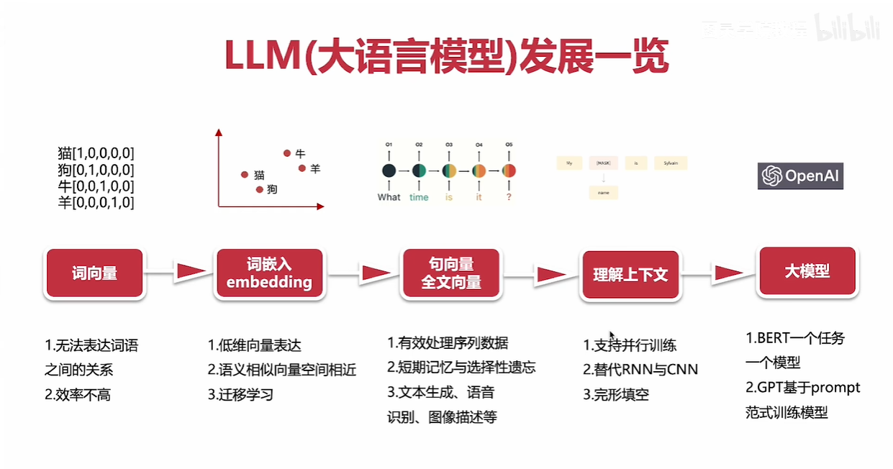
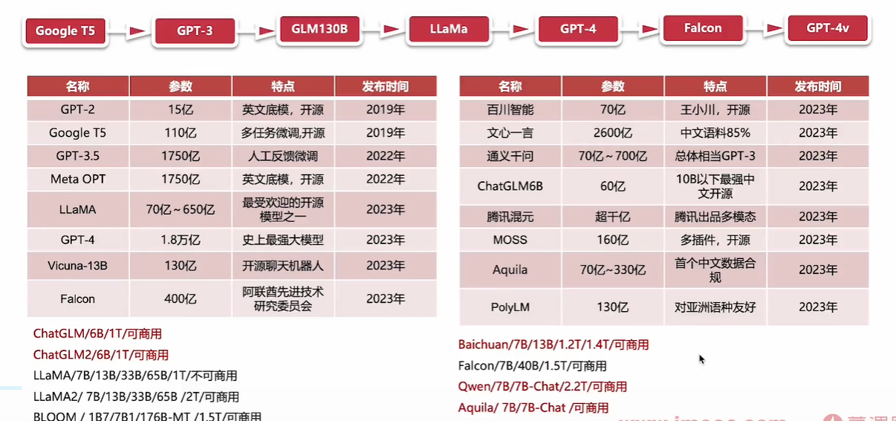
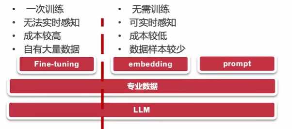
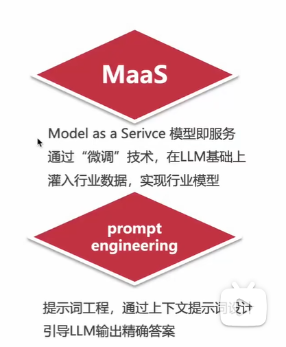
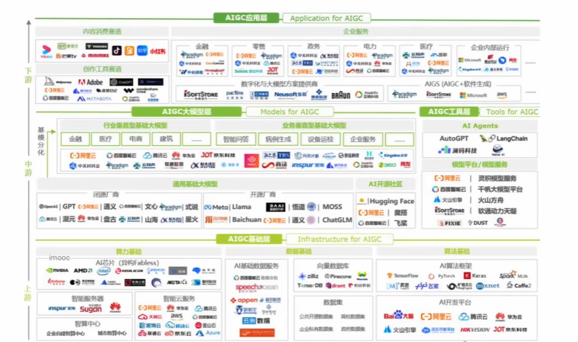
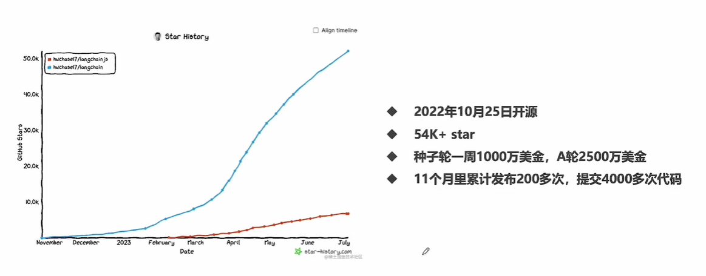
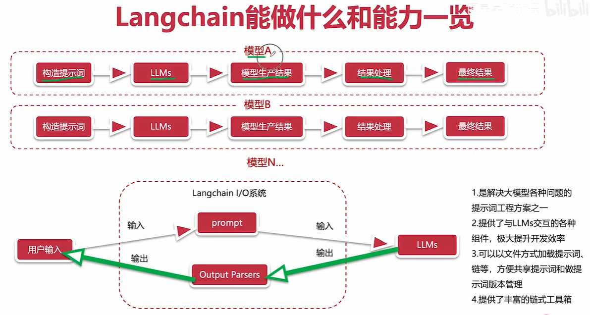
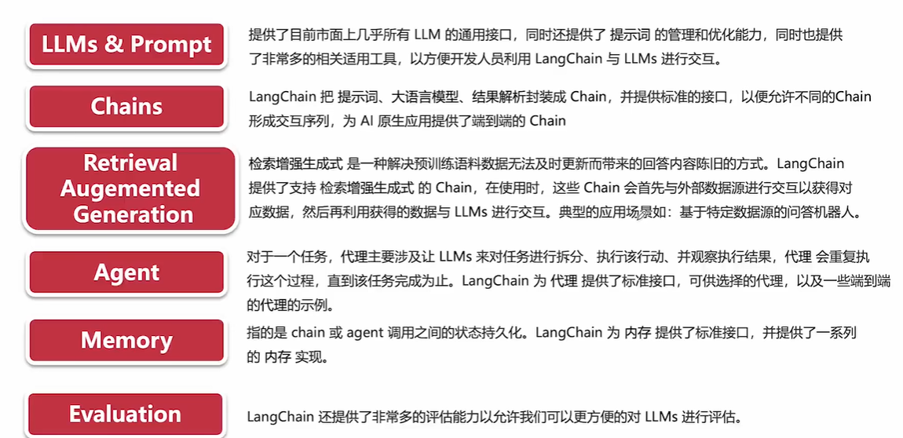
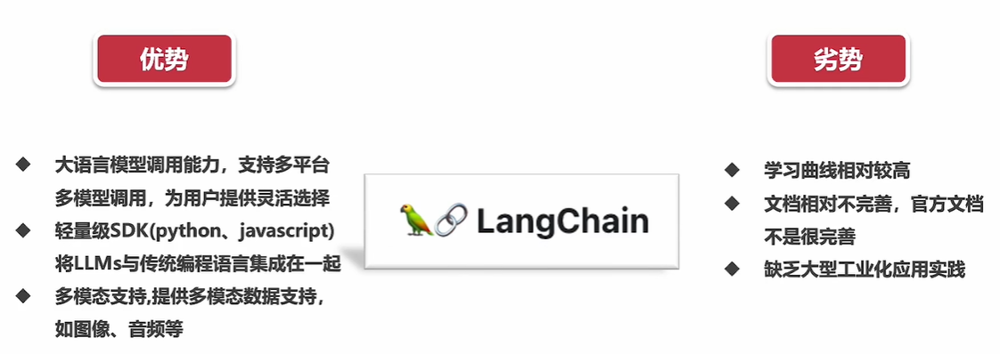

# 大模型AI Agent入门到精通实战教程

## LLM(大语言模型)发展一览

> [!NOTE]
>
> LLM即large language model

## 国内外主要LLM及特点介绍

> [!NOTE]
>
> 大语言模型**<u>参数</u>**代表了大语言模型的**<u>复杂程度</u>**
>
> 多模态指的是可以生成图片文字等等多种生成形式

### [Hugging Face](https://www.huggingface.co)

hugging face被誉为开源模型界的github

## 大模型的不足以及解决方案

1. 不具备记忆能力，上下文窗口限制(大模型对它的输入输出是有限制的，为了保护带宽等)
2. 实时信息更新慢，新旧知识难以区分
3. 无法为灵活的操控外部系统
4. 无法为领域问题，提供专业靠谱的答案

## AIGC产业拆解以及常见名词

## Langchain介绍

### 初识Langchain

> [!NOTE]
>
> LLM大模型与AI应用的粘合剂

### Langchain是什么以及发展过程

- Langchain是一个开源框架，旨在简化使用大型语言模型构建端到端应用程序的过程
- Langchain发展历程

### Langchain能做什么和能力一览

- 能做什么

- 能力详解

### Langchain的优势与劣势分析

### Langchain使用环境的搭建

- python安装
- jupyter notebook安装
- Langchain安装

### 第一个实例，了解Langchain的基本模块

> [!NOTE]
>
> 转到Langchain.ipynb

