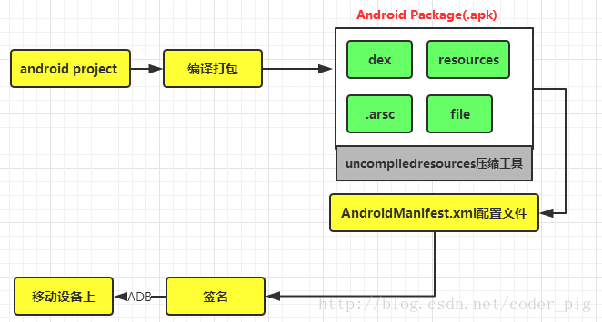
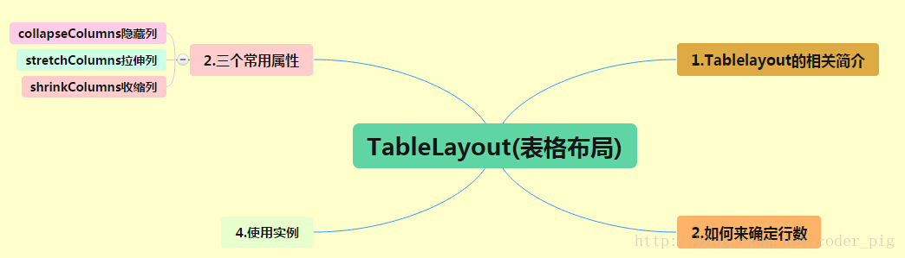
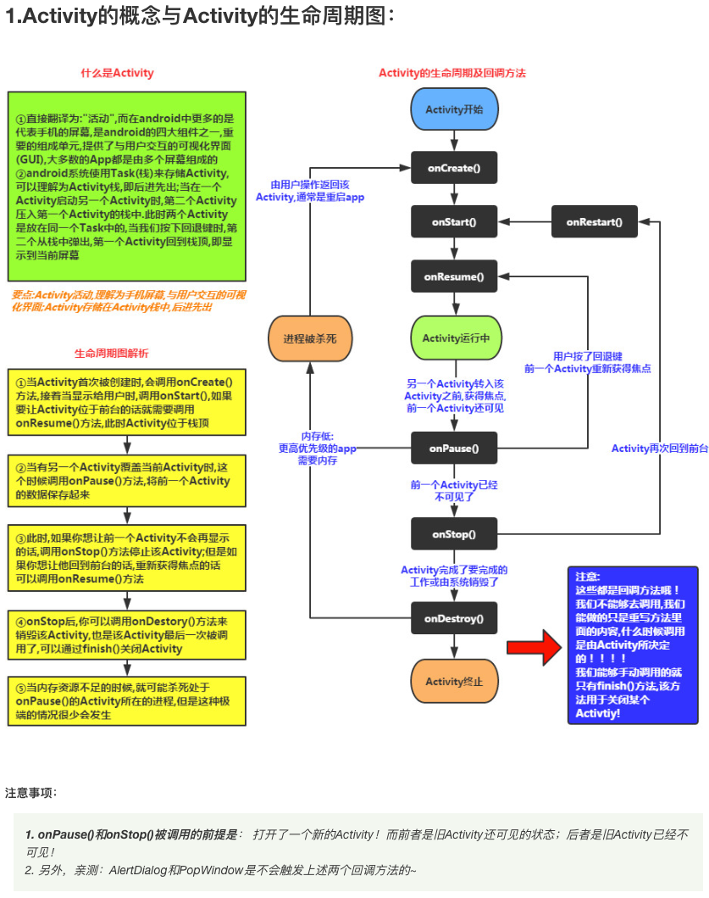

# Android Studio Notes

## Android系统特性和平台架构


**相关术语的解析**
1. Daivik：Android特有的虚拟机，运行在手机上，负责运行Android应用。
2. AVD（Android Virtual Device）：模拟器，用于在电脑上运行Android应用。
3. ADT（Android Development Tools）：Android开发工具包，包含了Android SDK、Android Studio、ADB（Android Debug Bridge）等工具。
4. SDK（Software Development Kit）：软件开发工具包，包含了开发Android应用所需的工具、库、文档、示例代码等。
5. DDMS（Device Debug Monitor Service）：Android设备调试监视服务，用于调试Android设备。
6. ADB（Android Debug Bridge）：Android调试桥，用于连接Android设备和电脑，并执行命令。
7. DX（Dex Compiler）：Dalvik虚拟机字节码编译器，用于将java代码编译成Dalvik字节码。
8. AAPT（Android Asset Packaging Tool）：Android资源打包工具，用于将资源文件编译成APK。
9. AndroidManifext.xml：Android应用清单文件，用于描述应用的基本信息。

**ADB命令**
1. 安装软件到设备：adb install [-r] [-s] <apk文件路径> ：安装apk到设备，-r表示覆盖安装，-s表示安装到sdcard。
2. 卸载软件：adb uninstall [-k] <包名> ：卸载指定包名的软件，-k表示保留数据和缓存目录。
3. 取出手机中的文件：adb pull <设备路径> <本地路径> ：从设备中取出指定路径的文件到本地。
4. 推送文件到手机：adb push <本地路径> <设备路径> ：将本地文件推送到设备中指定路径。
5. 进入手机终端：adb shell ：进入手机的终端。
6. 列出所有设备：adb devices ：列出所有连接的设备。
7. 重启设备：adb reboot ：重启设备。
8. 杀死adb进程：adb kill-server ：杀死adb进程。
9. 启动adb进程：adb start-server ：启动adb进程。

**app打包与安装的流程**


**签名**
Q：什么是签名？
A：android app都需要我们用一个证书对应用进行数字签名，签名的目的是为了保证应用的安全性，防止被恶意篡改。平时调试时AS会自动用默认的密钥和证书来签名，但我们实际发布时，不会自动签名，这时候需要进行手动签名。

Q：签名的作用？
A：1. 应用程序升级，只有以同一个证书签名，系统才会允许安装升级的应用程序，如果是不一样的证书，系统会要求应用程序采用不同的包名称。
2. 应用程序模块化：android允许同一个证书签名的多个应用在一个进程里运行，实际上是把他们作为单个程序，这样就可以单独升级其中一个模块，而不会影响其他模块。
3. 代码和数据共享：android提供了基于签名的权限机制，只有同一个证书签名的应用才能访问共享的数据。

## Android Studio
1. 创建新项目: File -> New -> New Project -> 选择你想创建的项目类型.
2. 项目目录介绍: 
   - libs: 包含了在项目中用到的所有库文件.
   - res: 包含所有资源文件, 包括布局文件, 图片, 颜色, 字符串等.
   - AndroidManifest.xml: 包含app的信息, 包括包名, 版本号, 权限等.
   - src: 包含项目的主要代码, 包括java文件, kotlin文件, 资源文件等.

## UI设计
在所有的app中，所有用户界面元素都是由View和ViewGroup组成的，View是最基本的用户界面元素，ViewGroup则是View的容器，可以包含其他View，并提供布局功能。

**布局方式**
|布局|说明|
|:---:|:---:|
| LinearLayout | 线性布局，按顺序从上到下依次排列子View。 |
| RelativeLayout | 相对布局，通过设置子View的相对位置来确定布局。 |
| FrameLayout | 帧布局，按顺序从上到下依次排列子View，但不提供布局功能。 |
| TableLayout | 表格布局，类似于网格布局，但不提供网格线。 |
| GridLayout | 网格布局，按网格线排列子View。 |
| AbsoluteLayout | 绝对布局，通过设置子View的绝对位置来确定布局。 |


1. LinearLayout

   - 设置分割线
     1. 在布局中直接添加View组件
         ```xml
         <View  
            android:layout_width="match_parent"  
            android:layout_height="1px"  
            android:background="#000000" />  
        ```
      2. 使用LinearLayout的divider属性
1. RelativeLayout

2. FrameLayout
3. TableLayout

4. GridLayout
5. AbsoluteLayout

**UI控件**
- **TextView**

|属性|说明|
|:---:|:---:|
| android:id | 控件的唯一标识符。 |
| android:layout_width | 控件的宽度 |
| android:layout_height | 控件的高度 |
| android:layout_margin | 控件的外边距 |
| android:layout_marginTop | 控件上边距 |
| android:layout_marginBottom | 控件下边距 |
| android:layout_marginLeft | 控件左边距 |
| android:layout_marginRight | 控件右边距 |
| android:text | 显示的文本内容 |
| android:textColor | 文本颜色 |
| android:textSize | 文本大小 |
| android:textStyle | 文本样式，如bold、italic等 |
| android:background | 背景颜色 |
| android:shadowColor | 阴影颜色 |
| android:shadowDx | 阴影水平偏移 |
| android:shadowDy | 阴影垂直偏移 |
| android:shadowRadius | 阴影的模糊程度 |
- **EditText**

|属性|说明|
|:---:|:---:|
| android:hint | 提示文本 |
| android:textColotHint | 提示文本颜色 |
| android:selectAllOnFocus | 输入框获得焦点时，是否全选文本 |
| android:inputType | 输入类型，如text、number、phone等 |
| android:minLines<br>android:maxLines | 最小行数和最大行数,默认是多行显示的，并且可以自动换行 |
| android:singleLine | 是否单行显示 |
| android:textScaleX<br>android:textScaleY | 设置字与字的水平和垂直间隔 ｜
| android:textColor | 文本颜色 |
| android:textSize | 文本大小 |
- **Button**

- **ImageView**

- **ToggleButton**

- **Switch**

- **ProgressBar**

- **SeekBar**

- **RatingBar**

- **ScrollView**

## Activity的概念和生命周期图
