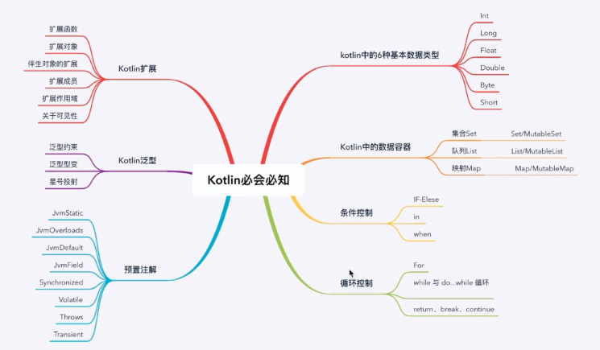
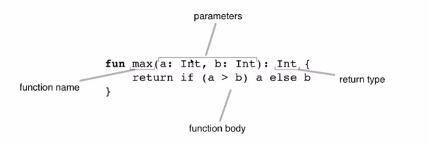
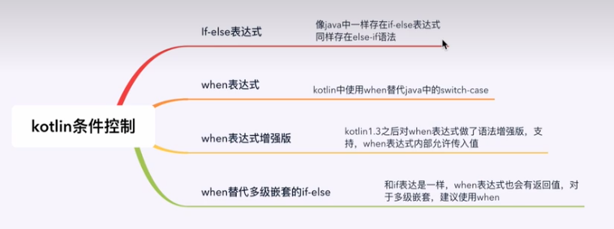

# Kotlin Notes

## What is Kotlin?

Kotlin is a **statically** typed programming language that is designed to interoperate fully with Java. It is developed by JetBrains and is known for its concise syntax and powerful features. Kotlin is designed to be a better language for Android development, with features such as null safety, coroutines, and data classes.

## Learning Path


#### Data Types
- Basic Data Types
  - Integers
    - Bytes
    - Shorts
    - Ints: default
    - Longs: if out of int range, use Long
  - Floats
  - Doubles
- Char
- Boolean
- Strings

|type|bits|
|:---:|:---:|
|byte|8|
|short|16|
|int|32|
|long|64|
|float|32|
|double|64|

**Q:What is bit width?**
A:All numbers in computer memory are represented in binary form. 
The 8bit as one byte.
So the int type usage is 4 bytes.
**Tips**
`val floatValue: Float = 3.14159268888f`
The floatValue only save **3.141593** but not 3.14159268888 because the float decimal point is 6.

**Strings Templates**
```kotlin
val a = "Lucas"
println("My name is $a")
println("My name is ${a}")
println("I am " + 25 + " years old")

val b = "Hello, World!\n"
val c = "{\"key\": \"value\"}"
val d = """{
    |"key": "value"
    |"key2": "value2"}
    """.trimMargin()
```
**explict type conversion**
```kotlin
val a: Int = 10
println(a.toString())
println(a.toDouble())
println(a.toFloat())
println(a.toLong())
println(a.toShort())
```
#### Data Operations
```kotlin
val a = 10
val b = 5
val num1 = a / b // 2
val num2 = a / b.toDouble() // 2.0
val num3 = (a / b).toFloat() // 2.0
```
**bit operations**
|function|description|
|:---:|:---:|
|shl(bits)|Shift left|
|shr(bits)|Shift right|
|ushr(bits)|Unsigned shift right|
|and(other)|Bitwise AND|
|or(other)|Bitwise OR|
|inv()|Bitwise NOT|
|xor(other)|Bitwise XOR|
```kotlin
val a = true
val b = false
val result = a or b // true
val result2 = a and b // false

val c = 10
val result3 = c shl 2 // 40
val result4 = c shr 1 // 5
val result5 = c ushr 1 // 5
```
#### Data Containers
- **Arrays**
  - It can't be resized.
  - It's fixed size.
```kotlin
// It contains all type of elements.
val array: Array<Int> = arrayOf(1, 2, 3, 4, 5)
val array: Array<Any> = arrayOf(1, true, "3", JSONObject())

// The "?" means the element can be null.
val array2: Array<String?> = arrayOfNulls<String>(5)

// Dyanmic creation of arrays.
val array3 = Array(5) { i -> i * 2 } // [0, 2, 4, 6, 8]
// It's the same as the previous one.
// The "it" keyword is used to represent the index of the element.
val array4 = Array(5) { it * 2 } // [0, 2, 4, 6, 8]
```
- **Sets**
  - List
  - Set
  - Map

|The method of created|Introduce|mutability|
|:---:|:---:|:---:|
|arrayListOf\<T>()<br>mutableListOf\<T>()|Must assign the type of elements|mutable|
|listOf\<T>()|1. Must assign the type of elements<br>2. Must initialize the elements|immutable|
|arrayMapOf\<T>()<br>mutableMapOf\<T>()|The initial elements must use Pair() to create a pair of key-value|mutable|
|mapOf\<T>()|1. The elements must use Pair() to create a pair of key-value<br>2. Must initialize the elements|immutable|
|arraysetOf\<T>()<br>mutableSetOf\<T>()|It will automatically remove the same elements|mutable|
|setOf\<T>()|1. It will automatically remove the same elements<br>2. Must assign the type of elements|immutable|

**Commonly used methods:**
|method|description|
|:---:|:---:|
|isEmpty()|Check if the container is empty|
|contains(element)|Check if the container contains the element|
|containsAll(elements)|Check if the container contains all the elements|
|get(index)|Get the element at the index|
|indexOf(element)|Get the index of the element|
|lastIndexOf()|Get the last index of the container|
|iterator()|Get the iterator of the container|
|add(element)|Add the element to the container|
|remove(element)|Remove the element from the container|
|clear()|Clear the container|
|set(index, element)|Set the element at the index|
|removeAt(index)|Remove the element at the index|
|reverse()|Reverse the order of the elements|
|shuffle()|Shuffle the elements|
|sort()|Sort the elements|
|sortDescending()|Sort the elements in descending order|


**Iterate**
```kotlin
val array = arrayOf(1, 2, 3, 4, 5)
for (item in array) {
    println(item)
}

for (i in array.indices){
    println(array[i])
}

for ((index, value) in array.withIndex()){
    println("index: $index, value: $value")
}

array.forEach {
    println(it)
}

array.forEachIndexed { index, value ->
    println("index: $index, value: $value")
}
```
#### Functions and Lambdas
###### **Functions**


```kotlin
//class
class Person(val name: String, val age: Int) {
    fun greet() {
        println("Hello, my name is $name and I am $age years old")
    }
    // companion class
    // If we want to define a static method in the normal class, we can use the companion object.
    companion object {
        fun createPerson(name: String, age: Int): Person {
            return Person(name, age)
        }
    }
}

fun main() {
    val person = Person("Lucas", 25)
    person.greet()
    Person.createPerson("Jack", 30).greet()
}

//static function
object MyObject {
    fun staticMethod() {
        println("This is a static method")
    }
}

fun main() {
    MyObject.staticMethod()
}
```
**Tips**
We can use the calling of function such as `fun xxx(action: () -> Unit){//xx}`.
The parameter `action` is parameter name and `()` is the type of parameter.
The `->` is the return type of the function.

**variadic parameters**
```kotlin
fun sum(vararg numbers: Int): Int {
    var result = 0
    for (number in numbers) {
        result += number
    }
    return result
}

sum(1, 2, 3, 4, 5) // 15
sum(1) // 1
sum() // 0
sum(1, 2, 3, 4, 5, 6, 7, 8, 9, 10) // 55
```
###### **Lambda Expressions**
```kotlin
view.setOnClickListener {
    view -> view.visibility
}

val numbers = arrayOf(1, 2, 3, 4, 5)

numbers.foreach{
    println(it)
}
```
#### Conditional

```kotlin
fun eval(num: Number): String = when (num) {
    200f -> {
        return "200"
    }
    is Int -> "Int"
    is Long -> "Long"
    is Float -> "Float"
    is Double -> "Double"
    else -> "Unknown"
}
```
#### Generics
**Generics Interface**
```kotlin
interface Animal<T> {
    fun eat(food: T)
}

class Dog: Animal<String> {
    override fun eat(food: String) {
        println("Dog is eating $food")
    }
}
```
**Generics Class**
```kotlin
abstract class Shape<T>(val sides: Int) {
    abstract fun calculateArea(): T
}

class Rectangle(val sides: Int): Shape<Double>(sides) {
    override fun calculateArea(): Double {
        return sides.toDouble()
    }
}


```