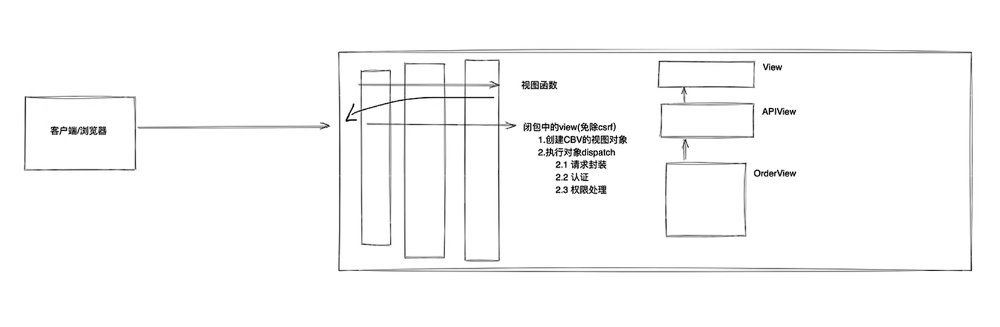

# rest_framework

> 1. 提供了定义序列化器Serializer的方法，可以快速根据 Django ORM 或者其它库自动序列化/反序列化;
> 2. 提供了丰富的类视图、Mixin扩展类，简化视图的编写;
> 3. 多种身份认证和权限认证方式的支持;
> 4. 直观的 API web 界面;
> Django

#### 状态码
- 200 OK - [GET]：服务器成功返回用户请求的数据
- 201 CREATED - [POST/PUT/PATCH]：用户新建或修改数据成功
- 202 Accepted - [*]：表示一个请求已经进入后台排队（异步任务）
- 204 NO CONTENT - [DELETE]：用户删除数据成功
- 400 INVALID REQUEST - [POST/PUT/PATCH]：用户发出的请求有错误，服务器没有进行新建或修改数据的操作
- 401 Unauthorized - [*]：表示用户没有权限（令牌、用户名、密码错误）
- 403 Forbidden - [*] 表示用户得到授权（与401错误相对），但是访问是被禁止的
- 404 NOT FOUND - [*]：用户发出的请求针对的是不存在的记录，服务器没有进行操作，该操作是幂等的
- 406 Not Acceptable - [GET]：用户请求的格式不可得（比如用户请求JSON格式，但是只有XML格式）
- 410 Gone -[GET]：用户请求的资源被永久删除，且不会再得到的
- 422 Unprocesable entity - [POST/PUT/PATCH] 当创建一个对象时，发生一个验证错误
- 500 INTERNAL SERVER ERROR - [*]：服务器发生错误，用户将无法判断发出的请求是否成功

5. FBV和CBV(Django支持)
   - FBV: function basic view
   - CBV: class basic view
6. FBV和CBV(drf角度分析)
   - `from rest_framework.views import APIView`
     - 其内部仍然执行的是Django中的view
     - 其最终的返回结果剔除csrf验证
     - 在前后端分离时，不再使用csrf验证
        ```python
        def as_view(...) -> 免除csrf认证

        def dispatch()   -> 视图执行前、反射执行视图，视图后处理
        ```
   - `from rest_framework.response import Response`
7. CBV
   - 在drf中的request实际上时request封装之后的，即request._request
        ```python
        class userView(APIView):
            def get(self, request):
                # 以下两个参数都可用
                self.args
                self.kwargs
        ```
# drf学习-上
1. 前后端分离
   - 不分离，后台系统&用户量少
   - 分离，用户系统&专业人士
2. 认证组件
   1. 应用
      - 用户登录
      - 实现
        - 编写类 -> 写组件
        ```python
        from rest_framework.authentication import BaseAuthentication
        class demo(BaseAuthentication):
                def authenticate(self, request):
                # 1.读取请求当中的token
                # 2.校验合法性
                # 3.返回值
                #  3.1 返回元组 认证成功 (user, auth)
                #  3.2 抛出异常 认证失败 -》 返回错误信息
                #  3.3 返回None 返回多个认证类的话，可以持续认证 若都不成功 -》 匿名用户
                token = request.query_params.get("token")
                if token:
                    return ("sunjianhua", token)
                # raise AuthenticationFailed("认证失败")
                raise AuthenticationFailed({"code":20000, "error":"认证失败"})
                pass
        ```
        - 认证组件
          - 在view类中定义`authentication_classes = [认证组件类名]`即可
          - 全局配置：在setting.py中添加`REST_FRAMEWORK={"DEFAULT_AUTHENTICATION_CLASSES":[认证组件的路径]}`即可，如有特殊需求无需验证的话给对应的view类中的属性置空
          - 结论：在drf中，优先从全局中读取，在从view类中读取
        - 认证组件类一定不能写在view.py文件中
          - 会有循环调用的问题
   2. 面向对象-继承
      - 结论：上述的认证组件时实现的原理就是面向对象的继承特点
   3. 源码分析
   4. 多个认证类
      - 都返回None，都没有认证成功，视图函数也会被执行，只不过self.user,self.auth均为None
      - 可以在最后写一个没有认证的类，直接抛出异常
   5. 状态码一致
      - 修改`authenticate_header()`函数return
   6. 扩展
      - 在父类中如果有`raise NotImplementedError(".authenticate() must be overridden.")`就会约束子类中必须实现这个方法
3. 案例 用户登录 + 用户认证
   - get请求可以使用`request.query_params`
   - post请求可以使用`request.data`
   - head可以访问`request.META`
    ```python
    import uuid
    class LoginView(APIView):
        authentication_classes = []

        def post(self, request, *args, **kwargs):
            # 1.接收用户的post提交的用户名和密码
            user = request.data.get("username")
            pwd = request.data.get("password")

            # 2.做数据库校验
            user_object = models.UserInfo.object.filter(username=user, password=pwd).first()
            if not user_object:
                return Response({"status":False, "msg":"用户名和密码错误"})

            # 3.正确
            token = str(uuid.uuid4())
            user_object.token = token
            user_object.save()

            return Response({"status": True, "data": token})
    ```
4. 权限组件
   - 和认证组件类似
   - 执行**所有**权限类中的`allow_request()`
   - 默认情况下，保证所有权限类中的`allow_request()`都返回True
   - 只有学会源码流程，才可以对权限组件做扩展和自定义
   1. 应用
    ```python
    from rest_framework.permissions import BasePermission
    import random

    class MyPermission(BasePermission):
        def has_permission(self, request, view):
            # 获取请求中的数据，然后校验
            v1 =random.randint(1, 3)
            if v1 == 2:
                return True
            return False
    ```
    2. 认证组件
         - 和认证组件认证方式类似，键名为`permission_classes`
         - 全局认证时，为`DEFAULT_PERMISSION_CLASSES`
    3. 抛出异常
    ```python
    from rest_framework.permissions import BasePermission
    import random

    class MyPermission(BasePermission):
        message = {"status":False, "msg":"无权访问"}

        def has_permission(self, request, view):
            # 获取请求中的数据，然后校验
            v1 =random.randint(1, 3)
            if v1 == 2:
                return True
            return False
    ```
    4. 源码分析
         - 结论：如有定制需求，可在源码中的`check_permissions()`函数中修改逻辑
         - 但在上线时很不友好，可以在继承子类中重写`check_permissions()`
         - 思路打开，可以继承重写APIView类，还可以定制任意一个类并重写
    5. 案例 用户登录 + 用户认证 + 角色
5. drf的认证、权限组件与django中的中间件有什么关系？

6. 限流组件
   - 开发过程中，开发的某个接口不希望用户访问过于频繁，限流机制，例如：手机号限制，平台限制1小时发10次
   - IP限制、验证码、爬虫等手段
   - 限制访问频率：首先找到唯一标识符
     - 已登陆用户 用户信息主键、ID、用户名
     - 未登录，IP为唯一标识
   - 如何限制？比如10分钟可以访问3次
     1. 获取当前时间
     2. 当前时间-10分钟=技术开始时间
     3. 删除小于16:35的时间
     4. 计算长度
        - 超过，错误
        - 未超过，访问
   1. 实现
      1. 编写类 为了速度更快可以将这个cache放在redis
         1. 编写类
         2. 安装django-redis配置 -》 settings.py
         3. 安装django-redis
         4. 启动redis服务
        ```python
        from rest_framework.throttling import BaseThrottle
        from rest_framework.throttling import SimpleRateThrottle

        class MyThrottle(SimpleRateThrottle):
            scope = "xxx"
            THROTTLE_RATES = {"xxx": "10/m"} # 访问频率
            cache = "xxxx" # 缓存地址
            def get_cache_key(self, request, view):
                if request.user:
                    ident = request.user.pk # 用户ID
                else:
                    ident = self.get_ident(request) # 获取请求用户IP（去request中找请求头)
                return self.cache_format % {"scope": self.scope, "ident": ident}
        ```
      2. 应用类
         - 和上述两个组件流程一致
   2. 源码分析
      - **p30-p33需要重新看**
# drf学习-中
1. **版本**
```python
from rest_framework.versioning import QueryParameterVersioning

class HomeView(APIView):
    # version 名称是在配置文件中的VERSION_PARAM
    # http://127.0.0.1/home?version=v1
    versioning_class = QueryParameterVersioning # 默认会读取url中的version

    def get(self, request):
        version = request.version
```
   - 源码分析
     - 结论：在setting.py可以设置版本
   - 版本控制: 基于路由传递
```python
class Home2View(APIView):
    # http://127.0.0.1/v2/home
    versioning_class = URLPathVersioning # 默认会读取url中的version -> v2

    def get(self, request):
        version = request.version
        return Response("...")
```
   - 请求头传递
```python
class Home3View(APIView):
    # http://127.0.0.1/v2/home
    versioning_class = AcceptHeaderVersioning # 默认会读取请求头中的version，看源码

    def get(self, request):
        version = request.version
        return Response("...")
```
   - 亦可以全局配置
2. **解析器**
   - 解析请求者发送过来的数据
   - 主要针对请求体中的数据
   - 流程
     1. 读取请求头
     2. 根据请求头解析数据
        1. 根据请求头获取解析器
        2. request.data = 解析器.parse
     3. request.data
   - 上传文件解析器
     - FileUploadParser
     
        
   - 混合数据解析器:既可以包含数据，也可以包含文件
     - MultiPartParser
     
        
3. **序列化器**
   - 元类
     - 创建类的两种方式，本质上由type创建
     
        
     - 在`type()`的基础上写继承
     
        
     - 所有指定metaclass类的子类均有metaclass创建
   - Tips:
     - object, 所有类的基类（公共功能，都写在这里面）
     - type，创建类
     - 其本质是由C结构体创建
     - `__new__()`和`__init__()`是由类中的`__call__()`触发的，在类作实例化时会触发`__call__()`
     - 执行顺序`__new__()` -> `__init__()`
     - 类其实也是一个对象，即如果没有指定，那所有类都是type类的对象
   - 使用序列化器:十分重要
     1. 序列化：从数据库获取Queryset或者数据对象转化成JSON格式
        - 使用起来和Form组件类似
        - 单个数据序列化
        
        
        - 多个数据序列化
        
        
        - 支持ModelSerializer
        
        
        - 多种格式类型的数据库字段需要字段的自定义
        
        
        - 自定义字段
        
        
        - 嵌套，支持ForeignKey、ManyToMany字段
        
        
        - 继承
        
        
     2. 序列化-源码流程
     
        
        - 序列化过程
        
        
        - 详细过程
          - P57-P64重新看
     4. 数据校验
        - 路由 -> 视图 -> request.data -> 校验（序列化类） -> 操作（如果是db，序列化器也可以）
        - Serializer
        
        
          - 内置校验
        
            
          - 正则校验
            - 可以写多个正则校验
            
            
          - 钩子校验
        
            
        - ModelSerializer
        
        
        - 序列器操作数据库
          - 可以直接存储：使用序列化器实例化对象的`save()`
          
            
          - 如果用户上传的数据多于数据库的键值，需要先`pop()`掉，然后在`save()`
          
            
        - ForeignKey处理
        
        
        - ManyToMany处理
        
        
        - Tips
          - 如果想要创建符合数据库，但不符合类中定义的字段时，需要自定义字段交给ModelSerializer
          
            
        - 继续看P74


     5. 数据校验-源码分析
     6. 同时进行数据校验和序列化
        - 写两个serializer分别用于校验和序列化
        - 一个serializer使用write_only和read_only来区分校验和序列化
        - 对于choice:
        
         
         
        - 对于ForeignKey:
        
         
        - 对于ManyToMany:举一反三，方法同上
4. **分页**
5. **视图**
