# Flutter

## 一、Flutter介绍

Flutter是谷歌公司开发的一款开源、免费的跨平台应用开发框架，使用Flutter不仅可以开发跨平台的手机app，还可以开发跨平台的桌面软件，目前Flutter已经支持IOS、Android、Web、Windows、macos、Linux的跨平台开发

**Flutter官网**：[https://flutter.dev](https://flutter.dev)

**Flutter Packages官网**：[https://pub.dev](https://pub.dev)

## 二、搭建Flutter运行环境

### 1.Android

- 电脑安装配置JAVA SDK
- 电脑下载安装Android Studio
- 电脑上下载配置Flutter SDK
- 配置Flutter国内镜像
- 运行`flutter doctor`命令检测环境是否配置成功，根据提示配置安装软件
- 打开Android Studio安装Flutter插件
- 创建运行Flutter项目

## 三、创建项目

1. 利用android studio创建项目
1. 利用`flutter create projectname `

### 目录结构

C:\USERS\MMT\DOCUMENTS\PROJECTS\FLUTTER\LEARNDAY
├─.dart_tool
│  └─dartpad
├─.idea
│  ├─libraries
│  └─runConfigurations
├─android	存放安卓应用的资源文件
├─ios		 存放ios应用资源文件
├─lib		  入口文件夹
├─linux	      linux应用资源文件
├─macos	   macos应用资源文件
├─test
├─web	       web开发资源文件
│  └─icons
└─windows       windows开发资源文件

->pubspec.yaml	代码配置文件

### 入口文件

#### - >lib/main.dart

``````dart
import 'package:flutter/material.dart';

void main(){
    runApp(const Center(
        child: 
        	Text("Hello World", textDirection: TextDirection.ltr,
                style: TextStyle(
                    color: Colors.fromRGBO(244, 244, 123, 1),
                    fontSize: 40.0
                )),
    ));
}
``````

##### 使用MaterialApp和Scaffold两个组件装饰APP

```
import 'package:flutter/material.dart';

void main(){
    runApp(
    	MaterialApp(
    		home: Scaffold(
    			appBar: AppBar(title: const Text("你好flutter")),
    		),
    		body: const Center(
    				child: 
        				Text("Hello World", textDirection: TextDirection.ltr,
                            style: TextStyle(
                                color: Colors.fromRGBO(244, 244, 123, 1),
                                fontSize: 40.0
                                )
			)
    	)
    );
}
```

##### 由于写上面的函数过于繁琐，可以将widget进行抽离,有两种方式，一种是继承StatelessWidget类，另一种就是继承StatefulWidget类

1. StatelessWidget是无状态组件，状态不可变的widget

```dart
import 'package:flutter/material.dart';

void main(){
    runApp(
    	MaterialApp(
    		home: Scaffold(
    			appBar: AppBar(title: const Text("你好flutter")),
    		),
    		body: const MyApp(),
    	)
    );
}
class MyApp extends StatelessWiget{
    const MyApp {Key? key}: super(key: key);
    
    @override
    Widget build(BuildContext context){
        return const Center(
    				child: Text("Hello World", textDirection: TextDirection.ltr,
                           	style: TextStyle(color: Colors.fromRGBO(244, 244, 123, 1),
                                fontSize: 40.0)
                         	)
				)
    }
}
```

2. StatefulWidget是有状态的组件，持有的状态可能在widget生命周期改变

```dart

```

## 四、常用组件详解

### A.Container组件和Text组件详解

#### Container容器

|      名称      | 功能                                                         |
| :------------: | :----------------------------------------------------------- |
| **alignment**  | **Alignment.topCenter**:顶部居中对齐；<br />**Alignment.topLeft**:顶部左对齐；<br />**Alignment.topRight**:顶部右对齐；<br />**Alignment.center**:水平垂直居中对齐；<br />**Alignment.centerLeft**:垂直居中水平居左对齐；<br />**Alignment.centerRight**:垂直居中水平居右对齐；<br />**Alignment.bottomCenter**:底部居中对齐；<br />**Alignment.bottomLeft**:底部居左对齐；<br />**Alignment.bottonRight**:底部居右对齐； |
| **decoration** | 圆角，背景线性渐变，RadialGradient径向渐变等等功能           |
|   **margin**   | 表示container与外部其他组件的距离                            |
|  **padding**   | 指的是container的内边距，指container边缘与child之间的距离    |
| **transform**  | 让container进行一些旋转之类的transform                       |
|   **height**   | 容器高度                                                     |
|   **width**    | 容器宽度                                                     |
|   **child**    | 容器子元素                                                   |

```dart
import 'package:flutter/material.dart';

void main(){
  runApp(
    MaterialApp(
      home: Scaffold(
        appBar: AppBar(title: const Text("你好Flutter")),
        body: MyApp()
      ),
    )
  );
}

class MyApp extends StatelessWidget{
  const MyApp({super.key});

  @override
  Widget build(BuildContext context){
    return Center(
      child: Container(
        alignment: Alignment.center,  // 配置容器内元素的方位
        width: 200,
        height: 200,
        decoration: BoxDecoration(
          color: Colors.red,   // 背景颜色
          border: Border.all(    // 边框
            color: Colors.green,
            width: 6
          ),
          borderRadius: BorderRadius.circular(50),  // 圆角
          boxShadow: [  // 配置阴影效果
            BoxShadow(
              color: Colors.black,
              blurRadius: 20.0
            )
          ],
          // gradient: LinearGradient(colors: [Colors.red, Colors.yellow]),  // 线性渐变
          gradient: RadialGradient(colors: [Colors.red, Colors.yellow]),  // 径向渐变
        ),
        child: Text("What Fuck?", style: TextStyle(
          color: Colors.blue,
          fontSize: 20
        ))
      ),
    );
  }
}
```

##### 效果展示

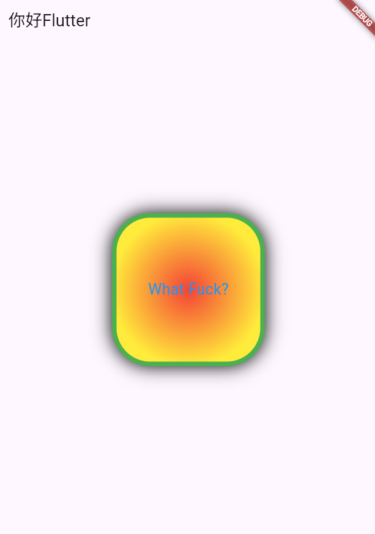

#### 按钮效果

```dart
import 'package:flutter/material.dart';

void main(){
  runApp(
    MaterialApp(
      home: Scaffold(
        appBar: AppBar(title: const Text("你好Flutter")),
        body: Column( // 垂直布局，将两个组件垂直排列
          children: [
            MyApp(),
            MyButton()
          ],
        )
      ),
    )
  );
}

class MyApp extends StatelessWidget{
  const MyApp({super.key});

  @override
  Widget build(BuildContext context){
    return Center(
      child: Container(
        alignment: Alignment.center,  // 配置容器内元素的方位
        width: 200,
        height: 200,
        // transform: Matrix4.translationValues(-40, 40, 0), // 位移
        // transform: Matrix4.rotationZ(0.4),  // 旋转
        transform: Matrix4.skewY(.2),  // 拉伸
        margin: EdgeInsets.fromLTRB(0, 60, 0, 20),
        decoration: BoxDecoration(
          color: Colors.red,   // 背景颜色
          border: Border.all(    // 边框
            color: Colors.green,
            width: 6
          ),
          borderRadius: BorderRadius.circular(50),  // 圆角
          boxShadow: [  // 配置阴影效果
            BoxShadow(
              color: Colors.black,
              blurRadius: 20.0
            )
          ],
          // gradient: LinearGradient(colors: [Colors.red, Colors.yellow]),  // 线性渐变
          gradient: RadialGradient(colors: [Colors.red, Colors.yellow]),  // 径向渐变
        ),
        child: Text("What Fuck?", style: TextStyle(
          color: Colors.blue,
          fontSize: 20
        ))
      ),
    );
  }
}

class MyButton extends StatelessWidget{
  const MyButton({super.key});

  @override
  Widget build(BuildContext context){
    return Container(
      alignment: Alignment.center,
      width: 200,
      height: 40,
      // padding: EdgeInsets.fromLTRB(20, 0, 0, 0), // 内边距
      decoration: BoxDecoration(
        color: Colors.blue,
        borderRadius: BorderRadius.circular(20)
      ),
      child: Text("Button", style: TextStyle(
        color: Colors.white,
        fontSize: 20,
      ),),
    );
  }
}
```

##### 效果展示

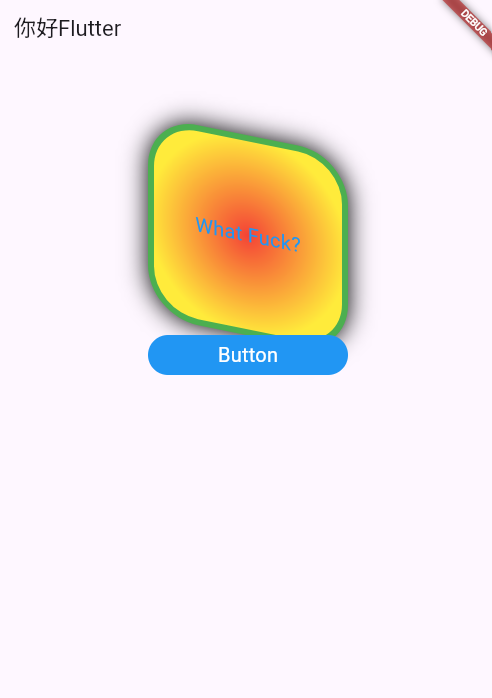

****

#### Text组件

|      名称       | 功能                                                         |
| :-------------: | ------------------------------------------------------------ |
|    textAlign    | 文本对齐方式(center居中，left左对齐，right右对齐，justfy两端对齐) |
|  textDirection  | 文本方向(ltr从左向右，rtl从右向左)                           |
|    overflow     | 文字超出屏幕之后的处理方式(clip裁剪，fade渐隐，ellipsis省略号) |
| textScaleFactor | 字体显示倍率                                                 |
|    maxLines     | 文字显示最大行数                                             |
|      style      | 字体的样式设置                                               |

```dart
class MyText extends StatelessWidget{
  MyText({Key? key}): super(key:key);

  @override
  Widget build(BuildContext context) {
    return Container(
      width: 200,
      height: 200,
      margin: EdgeInsets.all(20),
      decoration: BoxDecoration(
        border: Border.all(
          color: Colors.purple,
          width: 1,
        )
      ),
      child: Text("Hello I'm LucasHello I'm LucasHello I'm LucasHello I'm LucasHello I'm LucasHello I'm LucasHello I'm LucasHello I'm LucasHello I'm Lucas",
        textAlign: TextAlign.left,
        maxLines: 2,  // 最大显示行数
        overflow: TextOverflow.ellipsis,  // 内容溢出显示几个点
        style: TextStyle(
          fontSize: 20,
          fontWeight: FontWeight.w900,  // 字体加粗
          color: Colors.red,
          fontStyle: FontStyle.italic,  // 斜体
          letterSpacing: 6, // 字间距
          decoration: TextDecoration.underline,  // 下划线
          decorationColor: Colors.blue,
          decorationStyle: TextDecorationStyle.dashed,  // 线的形状
        ),
      )
    );
  }
}
```

##### 效果展示

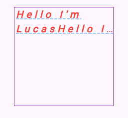

### B.Flutter图片组件Image

#### Image.network 远程加载图片

##### 属性详解

| 名称                  | 类型      | 说明                                                         |
| --------------------- | --------- | ------------------------------------------------------------ |
| alignment             | Alignment | 图片的对齐方式                                               |
| color和colorBlendMode |           | 设置图片的背景颜色，通常和colorBlendMode配合一起使用，这样可以是图片颜色和背景色混合 |
| fit                   | BoxFit    | fit属性用来控制图片的拉伸和挤压，这都是根据父容器来的<br />BoxFit.fill -> 全图显示，图片会被拉伸并充满父容器<br />BoxFit.contain -> 全图显示，显示原比例，可能会有空隙<br />BoxFit.cover -> 显示可能拉伸，可能裁剪，保证不变形充满整个容器<br />BoxFit.fitWidth -> 宽度充满（横向充满），显示可能拉伸，可能裁剪<br />BoxFit.fitHeight -> 高度充满（纵向充满），显示可能拉伸，可能裁剪<br />BoxFit.scaleDown -> 效果和contain差不多，但是此属性不允许显示超过原图片大小，可小不可大 |
| repeat                | 平铺      | ImageRepeat.repeat -> 横向和纵向都进行重复，直到铺满整个画布<br />ImageRepeat.repeatX -> 横向重复，纵向不重复<br />ImageRepeat.repeatY -> 纵向重复，横向不重复 |
| width                 |           | 宽度，一般结合ClipOval才能看到效果                           |
| height                |           | 高度，一般结合ClipOval才能看到效果                           |

更多属性参考：[https://api.flutter.dev/flutter/widgets/Image-class.html](https://api.flutter.dev/flutter/widgets/Image-class.html)

##### 实例代码

```dart
import 'package:flutter/material.dart';

void main(){
  runApp(
    MaterialApp(
      home: Scaffold(
        appBar: AppBar(title: const Text("你好Flutter")),
        body: MyApp(),
      ),
    )
  );
}

class MyApp extends StatelessWidget{
  // Flutter3x新写法
  const MyApp({super.key});

  @override
  Widget build(BuildContext context) {
    return Center(
      child: Container(
        // alignment: Alignment.center,  // 控制容器内子元素的位置，优先级更高
        height: 150,
        width: 300,
        decoration: BoxDecoration(
          color: Colors.yellow,
        ),
        child: Image.network(
          "https://img.iplaysoft.com/wp-content/uploads/2019/free-images/free_stock_photo_2x.jpg!0x0.webp",
          // scale: 2, // 表示将图片缩小一倍
          // alignment: Alignment.centerLeft,  // 控制图片在外部容器中的位置
          // fit: BoxFit.cover, // 根据父容器来控制图片的拉伸和挤压
          repeat: ImageRepeat.repeatX,  // 将图片重复显示以占满父容器
          
        ),
      )
    );
  }
}
```

##### 效果展示

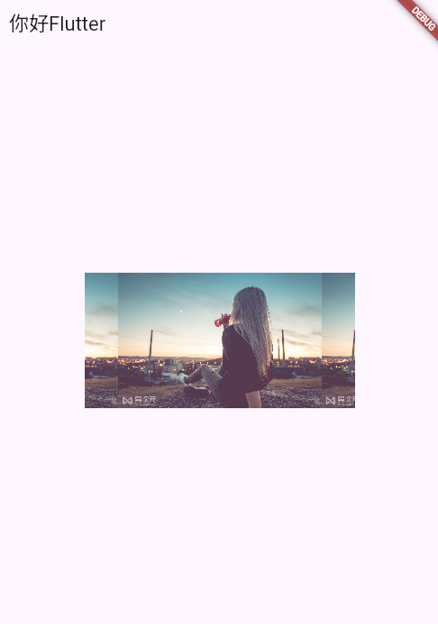

#### 圆角图片

##### 借助Container实现

###### 代码实现

```dart
class Circular extends StatelessWidget{
  const Circular({super.key});

  @override
  Widget build(BuildContext context) {
    // TODO: implement build
    return Container(
      height: 150,
      width: 150,
      decoration: BoxDecoration(
        color: Colors.yellow,
        borderRadius: BorderRadius.circular(75),
        image: DecorationImage(
          image: NetworkImage("https://img.iplaysoft.com/wp-content/uploads/2019/free-images/free_stock_photo_2x.jpg!0x0.webp"),
          fit: BoxFit.cover,
        ),
      ),
    );
  }
}
```

###### 效果展示


##### ClipOval实现

###### 代码展示

```dart
class ClipCircular extends StatelessWidget{
  const ClipCircular({super.key});

  @override
  Widget build(BuildContext context) {
    // TODO: implement build
    return ClipOval(
      child: Image.network(
        "https://img.iplaysoft.com/wp-content/uploads/2019/free-images/free_stock_photo_2x.jpg!0x0.webp",
        width: 200,
        height: 200,
        fit: BoxFit.cover,
      ),
    );
  }
```

###### 效果展示


#### Image.asset 加载本地图片

##### 使用方法

1. 项目根目录新建assets/images文件夹，images中新建2.0x和3.0x的文件夹
2. 在pubspec.yaml中配置assets字段

##### 代码示例

```dart
class LoadLocalImage extends StatelessWidget{
  const LoadLocalImage({super.key});

  @override
  Widget build(BuildContext context) {
    return Container(
      width: 150,
      height: 150,
      decoration: BoxDecoration(
        color: Colors.yellow,
      ),
      child: Image.asset(
        "images/2.0x/woman.jpg",
        fit: BoxFit.cover,
      ),
    );
  }
}
```

##### 效果展示

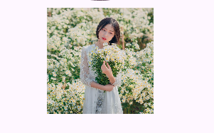

### C.Flutter ICON图标组件

Material Design所有图标可以在其官网查看：[https://material.io/tools/icons/](https://material.io/tools/icons/)

#### 内置图标

##### 代码示例

```dart
import 'package:flutter/material.dart';

void main(){
  runApp(MyApp());
}

class MyApp extends StatelessWidget{
  const MyApp({super.key});

  @override
  Widget build(BuildContext context) {
    return MaterialApp(
      theme: ThemeData(
        primarySwatch: Colors.blue, // 明显的是主题颜色
      ),
      home: Scaffold(
        appBar: AppBar(title: Text("qwea接外圈刮"),),
        body: MyHomepage(),
      ),
    );
  }
}

class MyHomepage extends StatelessWidget{
  MyHomepage({super.key});

  @override
  Widget build(BuildContext context) {
    return Column(
      children: [
        SizedBox(height: 20,),
        Icon(Icons.home, color: Colors.red,),
        Icon(Icons.settings,),  // 这些都是内置图标
        Icon(Icons.search),
        Icon(Icons.personal_injury_outlined),
        Icon(Icons.category_outlined, size: 60,),
      ],
    );
  }
}
```

##### 效果展示

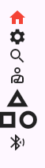

#### 自定义图标

##### 使用方法

1. 下载并导入字体图标文件；

```yaml
fonts:
  - family: MyIcon	# 指定一个字体名
    fonts:
      - asset: fonts/Schyler-Regular.ttf
      - asset: fonts/Schyler-Italic.ttf
        style: italic
```

2. 定义一个MyIcons类，功能和Icons类一样，将字体文件中的所有图标都定义成静态变量

```dart
import 'package:flutter/material.dart';

class MyIcons{
  static IconData book = IconData(
    0x2322, // 编码
    fontFamily: "MyIcon",  // 在pubspec.yaml中配置的名字
    matchTextDirection: true, // 匹配文字方向生成
  );
}
```

### D.ListView组件

#### 快速使用

> [!NOTE]
>
> 这样可以保证当容器内组件数量或者大小超出屏幕范围可以上下左右滚动，而不是警告

```dart
class MyHomepage extends StatelessWidget{
  MyHomepage({super.key});

  @override
  Widget build(BuildContext context) {
    return ListView(
      children: [
        SizedBox(height: 20,),
        Icon(Icons.home, color: Colors.red,),
        Icon(Icons.settings,),  // 这些都是内置图标
        Icon(Icons.search),
        Icon(Icons.personal_injury_outlined),
        Icon(Icons.category_outlined, size: 60,),
        Icon(Icons.bluetooth_audio),
        Icon(Icons.wechat, color: Colors.green, size: 120,),
        Icon(Icons.home, color: Colors.red,),
        Icon(Icons.settings,),  // 这些都是内置图标
        Icon(Icons.search),
        Icon(Icons.personal_injury_outlined),
        Icon(Icons.category_outlined, size: 60,),
        Icon(Icons.bluetooth_audio),
        Icon(Icons.wechat, color: Colors.green, size: 120,),
        Icon(Icons.home, color: Colors.red,),
        Icon(Icons.settings,),  // 这些都是内置图标
        Icon(Icons.search),
        Icon(Icons.personal_injury_outlined),
        Icon(Icons.category_outlined, size: 60,),
        Icon(Icons.bluetooth_audio),
        Icon(Icons.wechat, color: Colors.green, size: 120,),
      ],
    );
  }
}
```

#### 常用属性

列表布局是我们项目开发中最常用的一种布局方式。Flutter中我们可以通过ListView来定义列表项，支持垂直和水平方向展示。通过一个属性就可以控制列表的显示方向，列表有以下分类：

1. 垂直列表
2. 垂直图文列表
3. 水平列表
4. 动态列表

|      名称       | 类型                | 说明                                               |
| :-------------: | ------------------- | -------------------------------------------------- |
| scrollDirection | Axis                | Axis.horizontal水平列表<br />Axis.vertical垂直列表 |
|     padding     | EdgeInsertsGeometry | 内边距                                             |
|     resolve     | bool                | 组件反向排序                                       |
|    children     | List                | 列表元素                                           |

##### 垂直列表

###### 代码示例01

```dart
import 'package:flutter/material.dart';

void main(){
  runApp(MyApp());
}

class MyApp extends StatelessWidget{
  const MyApp({super.key});

  @override
  Widget build(BuildContext context) {
    return MaterialApp(
      theme: ThemeData(
        primarySwatch: Colors.blue, // 明显的是主题颜色
      ),
      home: Scaffold(
        appBar: AppBar(title: Text("qwea接外圈刮"),),
        body: MyHomepage(),
      ),
    );
  }
}

class MyHomepage extends StatelessWidget{
  MyHomepage({super.key});

  @override
  Widget build(BuildContext context) {
    return ListView(
      children: <Widget>[
        ListTile(title: Text("我是列表")),  // 一般和ListView配合使用
        Divider(),  // 横线 分割线
        ListTile(title: Text("我是列表")),
        Divider(),
        ListTile(title: Text("我是列表")),
        Divider(),
        ListTile(title: Text("我是列表")),
        Divider(),
        ListTile(title: Text("我是列表")),
        Divider(),
        ListTile(title: Text("我是列表")),
        Divider(),
        ListTile(title: Text("我是列表")),
        Divider(),
        ListTile(title: Text("我是列表")),
        Divider(),
        ListTile(title: Text("我是列表")),
        Divider(),
        ListTile(title: Text("我是列表")),
        Divider(),
        ListTile(title: Text("我是列表")),
        Divider(),
        ListTile(title: Text("我是列表")),
        Divider(),
      ],
    );
  }
}
```

###### 效果展示01

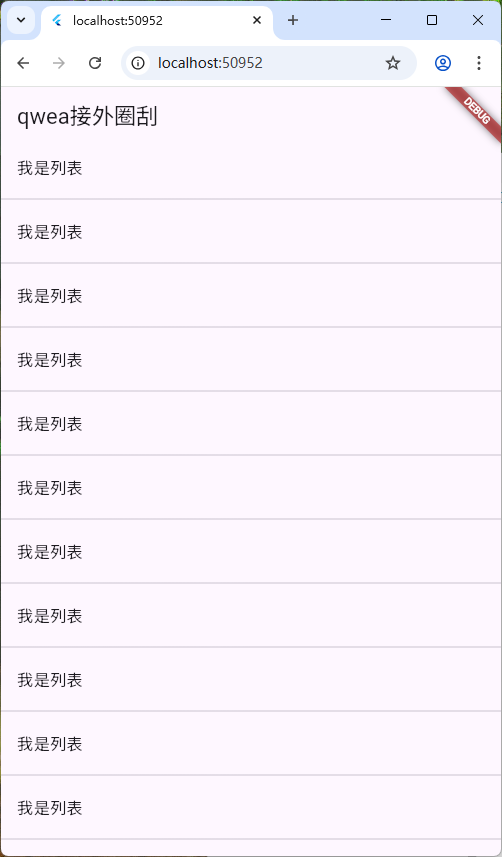

###### 代码示例02

```dart
class MyHomepage extends StatelessWidget{
  MyHomepage({super.key});

  @override
  Widget build(BuildContext context) {
    return ListView(
      padding: EdgeInsets.all(10),
      children: <Widget>[
        Divider(),
        ListTile(
          leading: Image.network("https://gips3.baidu.com/it/u=3526938358,3379384930&fm=3028&app=3028&size=w931&q=75&n=0&f=PNG&fmt=auto&maxorilen2heic=2000000"),
          title: Text("特朗普：让加拿大加入美国没开玩笑"),
          subtitle: Text("报道称，特朗普在25日发布于《时代》周刊的专访报道中作出上述表态。当主持人在采访中提及，特朗普曾多次提出让加拿大并入美国", overflow: TextOverflow.ellipsis,), // 二级标题
          trailing: Image.network("https://gips3.baidu.com/it/u=3526938358,3379384930&fm=3028&app=3028&size=w931&q=75&n=0&f=PNG&fmt=auto&maxorilen2heic=2000000"),
        ),
        Divider(),
      ],
    );
  }
}
```

###### 效果展示02

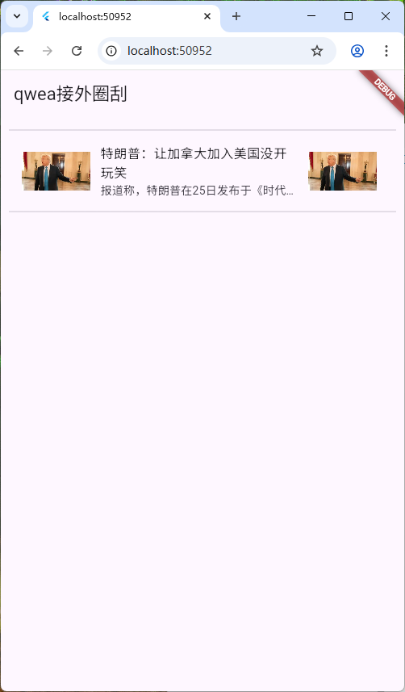

##### 垂直图文列表

###### 代码示例

```dart
class MyHomepage extends StatelessWidget{
  MyHomepage({super.key});

  @override
  Widget build(BuildContext context) {
    return ListView(
      // padding: EdgeInsets.all(10),
      children: <Widget>[
        Image.network("https://gips3.baidu.com/it/u=3526938358,3379384930&fm=3028&app=3028&size=w931&q=75&n=0&f=PNG&fmt=auto&maxorilen2heic=2000000"),
        SizedBox(
          height: 44,
          child: Text("川普：我是一个傻逼", textAlign: TextAlign.center, style: TextStyle(fontSize: 18),),
        ),
        Image.network("https://gips3.baidu.com/it/u=3526938358,3379384930&fm=3028&app=3028&size=w931&q=75&n=0&f=PNG&fmt=auto&maxorilen2heic=2000000"),
        Image.network("https://gips3.baidu.com/it/u=3526938358,3379384930&fm=3028&app=3028&size=w931&q=75&n=0&f=PNG&fmt=auto&maxorilen2heic=2000000"),
        Image.network("https://gips3.baidu.com/it/u=3526938358,3379384930&fm=3028&app=3028&size=w931&q=75&n=0&f=PNG&fmt=auto&maxorilen2heic=2000000"),
        Image.network("https://gips3.baidu.com/it/u=3526938358,3379384930&fm=3028&app=3028&size=w931&q=75&n=0&f=PNG&fmt=auto&maxorilen2heic=2000000"),
        Image.network("https://gips3.baidu.com/it/u=3526938358,3379384930&fm=3028&app=3028&size=w931&q=75&n=0&f=PNG&fmt=auto&maxorilen2heic=2000000"),
        Image.network("https://gips3.baidu.com/it/u=3526938358,3379384930&fm=3028&app=3028&size=w931&q=75&n=0&f=PNG&fmt=auto&maxorilen2heic=2000000"),
        Image.network("https://gips3.baidu.com/it/u=3526938358,3379384930&fm=3028&app=3028&size=w931&q=75&n=0&f=PNG&fmt=auto&maxorilen2heic=2000000"),
        Image.network("https://gips3.baidu.com/it/u=3526938358,3379384930&fm=3028&app=3028&size=w931&q=75&n=0&f=PNG&fmt=auto&maxorilen2heic=2000000"),
      ],
    );
  }
}
```

###### 效果展示

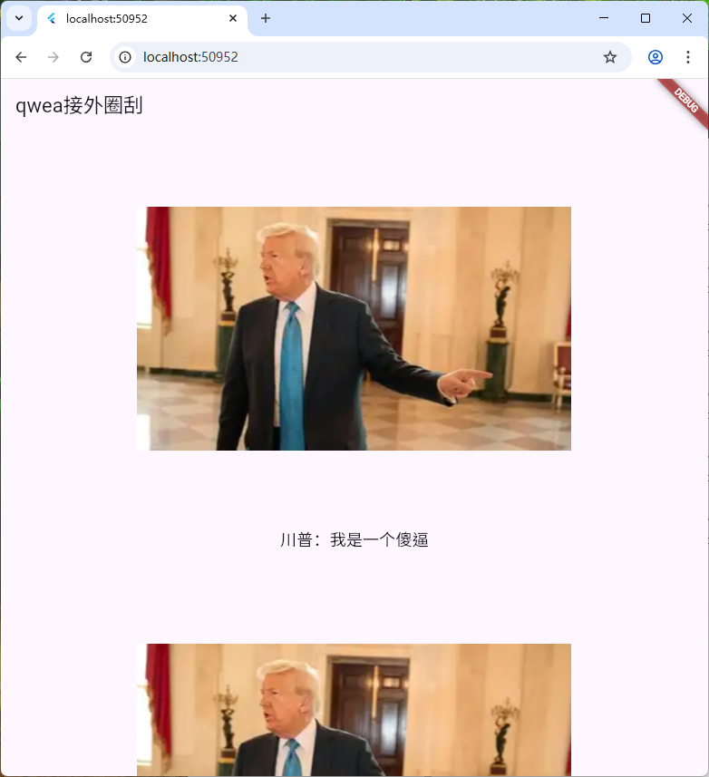

##### 水平列表

###### 代码示例

```dart
class MyHomepage extends StatelessWidget{
  const MyHomepage({super.key});

  @override
  Widget build(BuildContext context) {
    return SizedBox(height: 20, child: ListView(  // 在外层设置才可以有效果
      scrollDirection: Axis.horizontal, // 水平列表
      children: [
        Container(
          height: 120,  // 在水平列表中高度自适应，设置没有效果
          width: 120,  // 在垂直列表中宽度自适应，设置没有效果
          decoration: BoxDecoration(
            color: Colors.red,
          ),
        ),
        Container(
          height: 120,
          width: 120,
          decoration: BoxDecoration(
            color: Colors.pink,
          ),
        ),
        Container(
          height: 120,
          width: 120,
          decoration: BoxDecoration(
            color: Colors.indigo,
          ),
        ),
        Container(
          height: 120,
          width: 120,
          decoration: BoxDecoration(
            color: Colors.yellowAccent,
          ),
        ),
        Container(
          height: 120,
          width: 120,
          decoration: BoxDecoration(
            color: Colors.redAccent,
          ),
        ),
        Container(
          height: 120,
          width: 120,
          decoration: BoxDecoration(
            color: Colors.amber,
          ),
        ),
        Container(
          height: 120,
          width: 120,
          decoration: BoxDecoration(
            color: Colors.cyan,
          ),
        ),
        Container(
          height: 120,
          width: 120,
          decoration: BoxDecoration(
            color: Colors.black87,
          ),
        ),
        Container(
          height: 120,
          width: 120,
          decoration: BoxDecoration(
            color: Colors.grey,
          ),
        ),
      ],
    ));
  }
}
```

###### 效果展示

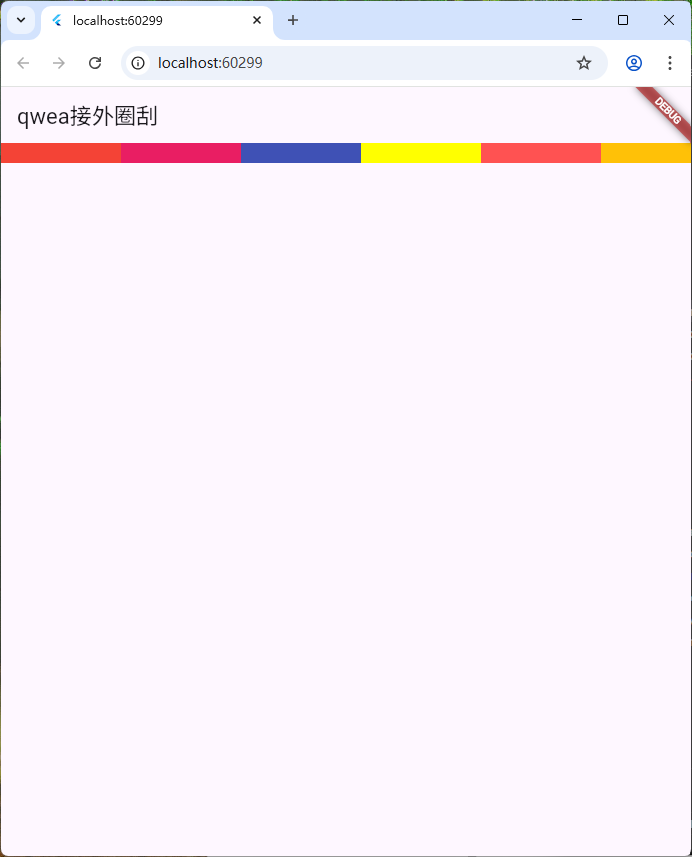

##### 动态列表

###### 代码展示

```dart
class MyHomepage extends StatelessWidget{
  const MyHomepage({super.key});

  List<Widget> _initLivedata(){
    List<Widget> list = [];
    for (var i=0; i<20; i++){
      list.add(ListTile(
        title: Text("I'm a dynamic list$i!"),
      ));
      list.add(Divider());
    }
    return list;
  }

  @override
  Widget build(BuildContext context) {
    return ListView(  // 通过循环展示列表，即动态列表
      children: _initLivedata(),
    );
  }
}

// Another method
class MyHomepage extends StatelessWidget{
  List<String> list = [];
  MyHomepage({super.key}){
    for (var i=0;i<20;i++){
      list.add("I'm ${i}th dynamic data.");
    }
  }

  @override
  Widget build(BuildContext context) {
    return ListView.builder(
      itemCount: list.length,
      itemBuilder: (context, index){
        return ListTile(title: Text(list[index]),);
      },
    );
  }
}
```

###### 效果展示

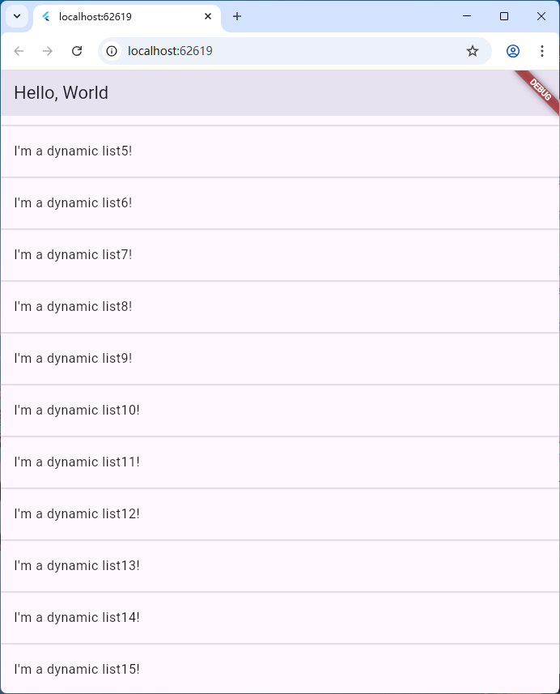

### E.GridView组件

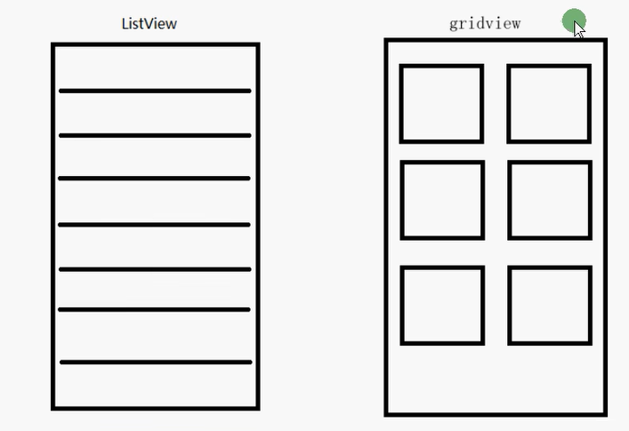

#### Grid创建网格列表主要有三种方式

1. 可以通过GridView.count实现网格布局
2. 可以通过GridView.extent实现网格布局
3. 通过GridView.builder实现动态网格布局

#### 常用属性

| 名称              | 类型                                                         | 说明                                 |
| ----------------- | ------------------------------------------------------------ | ------------------------------------ |
| scrollDirection   | Axis                                                         | 滚动方法                             |
| padding           | EdgeInsetsGeometry                                           | 内边距                               |
| resolve           | bool                                                         | 组件反向排序                         |
| crossAxisSpacing  | double                                                       | 水平子widget之间间距                 |
| mainAxisSpacing   | double                                                       | 垂直子widget之间间距                 |
| crossAxisCount    | int用在GridView.count                                        | 一行的Widget数据                     |
| maxCrossAxisCount | double用在GridView.extent                                    | 横轴子元素的最大长度                 |
| childAspectRatio  | double                                                       | 子widget宽度比例                     |
| children          |                                                              | []                                   |
| gridDelegate      | SliverGridDelegateWithFixedCrossAxisCount<br />SliverGridDelegateWithMaxCrossAxisExtent | 控制布局主要用在GridView.builder里面 |

#### GridView.count

```dart
import 'package:flutter/material.dart';

void main(){
  runApp(MyApp());
}

class MyApp extends StatelessWidget{
  const MyApp({super.key});

  @override
  Widget build(BuildContext context) {
    return MaterialApp(
      title: "Flutter Demo",
      theme: ThemeData(
        primarySwatch: Colors.blue, // 明显的是主题颜色
      ),
      home: Scaffold(
        appBar: AppBar(title: Text("Hello, World"),),
        body: MyHomepage(),
      ),
    );
  }
}

class MyHomepage extends StatelessWidget{
  const MyHomepage({super.key});

  @override
  Widget build(BuildContext context) {
    return GridView.count(
      crossAxisCount: 10,
      children: [
        Icon(Icons.pedal_bike),
        Icon(Icons.home),
        Icon(Icons.ac_unit),
        Icon(Icons.search),
        Icon(Icons.settings),
        Icon(Icons.airport_shuttle),
        Icon(Icons.all_inclusive),
        Icon(Icons.beach_access),
        Icon(Icons.cake),
        Icon(Icons.circle),
      ],
    );
  }
}
```

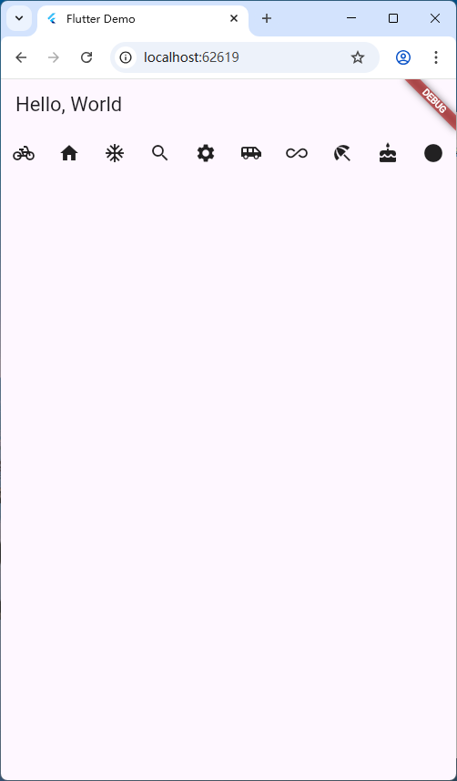

```dart
// 动态生成列表
class MyHomepage extends StatelessWidget{
  const MyHomepage({super.key});

  List<Widget> _initListData(){
    List<Widget> list = [];
    for (var i=0;i<13;i++){
      list.add(
        Container(
          alignment: Alignment.center,
          decoration: BoxDecoration(
            color: Colors.blue
          ),
          child: Text("I'm the ${i}th element."),
        )
      );
    }
    return list;
  }

  @override
  Widget build(BuildContext context) {
    return GridView.count(
      padding: EdgeInsets.all(10),
      crossAxisCount: 2,
      // maxCrossAxisExtent: 150,
      crossAxisSpacing: 10,
      mainAxisSpacing: 10,
      childAspectRatio: 0.6125,  // 宽高比
      children: _initListData(),
    );
  }
}

// 或者map方式
class MyHomepage extends StatelessWidget{
  const MyHomepage({super.key});

  List<Widget> _initListData(){
    List list = [];
    for (var i=0;i<13;i++){
      list.add({"title":"I'm the ${i}th element."});	// 模拟服务器读出的数据
    }
    var tempList = list.map((value){
      return Container(
        alignment: Alignment.center,
        decoration: BoxDecoration(
          color: Colors.amber,
        ),
        child: Text(value["title"]),
      );
    });
    return tempList.toList();
  }

  @override
  Widget build(BuildContext context) {
    return GridView.extent(
      padding: EdgeInsets.all(10),
      // crossAxisCount: 2,
      maxCrossAxisExtent: 150,
      crossAxisSpacing: 10,
      mainAxisSpacing: 10,
      childAspectRatio: 0.6125,  // 宽高比
      children: _initListData(),
    );
  }
}
```


#### GridView.extent

```dart
class MyHomepage extends StatelessWidget{
  const MyHomepage({super.key});

  @override
  Widget build(BuildContext context) {
    return GridView.extent(
      // 通过它可以快速创建横轴子元素为固定最大长度的GridView
      maxCrossAxisExtent: 120,  // 横轴子元素的最大长度
      children: [
        Icon(Icons.pedal_bike),
        Icon(Icons.home),
        Icon(Icons.ac_unit),
        Icon(Icons.search),
        Icon(Icons.settings),
        Icon(Icons.airport_shuttle),
        Icon(Icons.all_inclusive),
        Icon(Icons.beach_access),
        Icon(Icons.cake),
        Icon(Icons.circle),
      ],
    );
  }
}
```

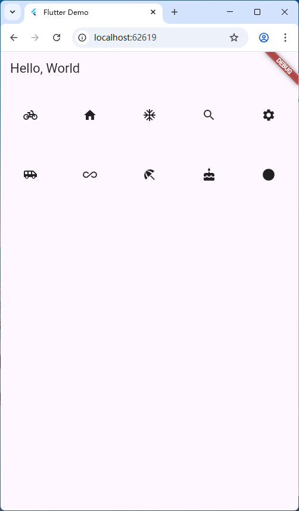

```dart
// 动态生成列表
class MyHomepage extends StatelessWidget{
  const MyHomepage({super.key});

  List<Widget> _initListData(){
    List<Widget> list = [];
    for (var i=0;i<13;i++){
      list.add(
        Container(
          alignment: Alignment.center,
          decoration: BoxDecoration(
            color: Colors.blue
          ),
          child: Text("I'm the ${i}th element."),
        )
      );
    }
    return list;
  }

  @override
  Widget build(BuildContext context) {
    return GridView.extent(
      padding: EdgeInsets.all(10),
      // crossAxisCount: 2,
      maxCrossAxisExtent: 150,
      crossAxisSpacing: 10,
      mainAxisSpacing: 10,
      childAspectRatio: 0.6125,  // 宽高比
      children: _initListData(),
    );
  }
}
```

#### GridView.builder

```dart
class MyHomepage extends StatelessWidget{
  const MyHomepage({super.key});

  @override
  Widget build(BuildContext context) {
    return GridView.builder(
      padding: EdgeInsets.all(10),
      itemCount: 12,
      // 还有SliverGridDelegateWithMaxCrossAxisExtent，作用就和extent和count差不多
      gridDelegate: SliverGridDelegateWithFixedCrossAxisCount(
        crossAxisCount: 2,
        mainAxisSpacing: 10,
        crossAxisSpacing: 10,
        childAspectRatio: 0.9,
      ),
      itemBuilder: (context, index){
        return Container(
        alignment: Alignment.center,
        decoration: BoxDecoration(
          color: Colors.amber,
        ),
        child: Column(
          children: [
         	 Image.network("http://gips3.baidu.com/it/u=3886271102,3123389489&fm=3028&app=3028&f=JPEG&fmt=auto?w=1280&h=960"),
            SizedBox(height: 10),
            Text("$index", style: TextStyle(
              fontSize: 20,
            ),)
          ],
        ),
      );
      },
    );
  }
}
```

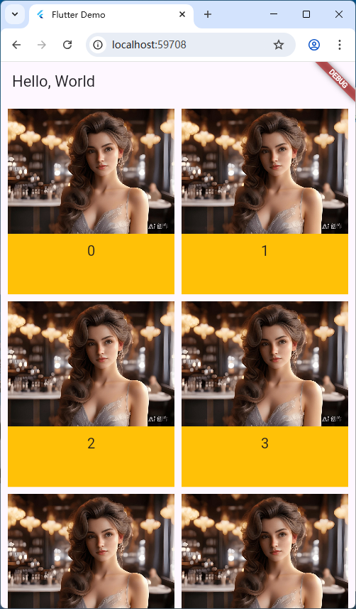

### F.Flutter页面布局 Padding Row Column Flex Expanded组件详解

#### padding组件

在html中常见的布局标签都有padding属性，但是Flutter中很多Widget是没有padding属性，这个时候我们可以用Padding组件处理容器与子元素之间的间距。

| 属性    | 说明                              |
| ------- | --------------------------------- |
| padding | padding值，EdgeInsets设置填充的值 |
| child   | 子组件                            |

```dart
class MyHomepage extends StatelessWidget{
  const MyHomepage({super.key});

  @override
  Widget build(BuildContext context) {
    return Padding(
      padding: EdgeInsets.all(10),
      child: Text("nihao"),
    );
  }
}
```

#### Row水平组件

| 属性               | 说明           |
| ------------------ | -------------- |
| mainAxisAlignment  | 主轴的排序方式 |
| crossAxisAlignment | 次轴的排序方式 |
| children           | 组件子元素     |


#### Column垂直组件

| 属性               | 说明           |
| ------------------ | -------------- |
| mainAxisAlignment  | 主轴的排序方式 |
| crossAxisAlignment | 次轴的排序方式 |
| children           | 组件子元素     |

